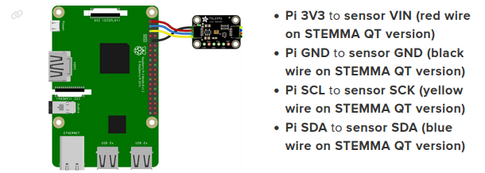
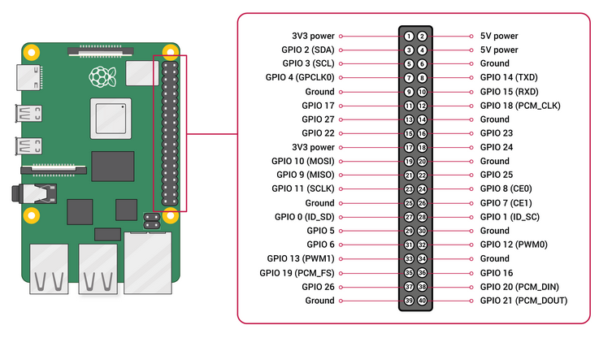

Title: 2 How to connect Adafruit TSL2591 High Dynamic Range Digital Light Sensor to a Raspberry Pi
Date: 2022-12-14
Category: Connect TLS with RPi

Use a [STEMMA cable](https://learn.adafruit.com/introducing-adafruit-stemma-qt/what-is-stemma-qt)
to connect the TSL to the RPi.

[Here](https://learn.adafruit.com/adafruit-tsl2591?view=all#python-computer-wiring-2997855) is explained in more detail how to connect TSL to a RPi.

  
Taken from [here](https://learn.adafruit.com/adafruit-tsl2591?view=all#step-2997856).

These are the GPIO pins (general-purpose input/output) of a RPi (taken from [here](https://www.raspberrypi.com/documentation/computers/raspberry-pi.html)).

[Here](https://learn.adafruit.com/adafruit-tsl2591?view=all#step-3073289) is explained how to connect TSL to devices generally.
